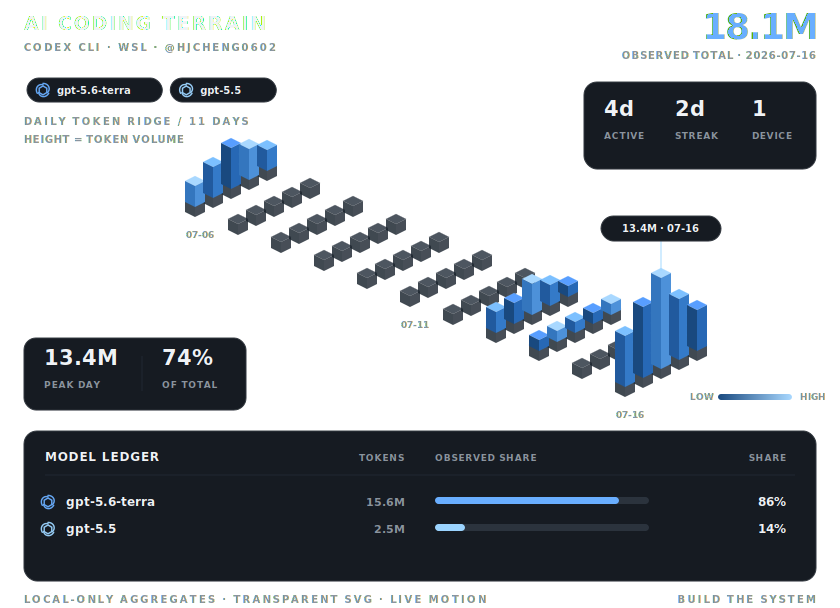

# Hi, I'm HJ Cheng 👋

Building AI systems from models to infrastructure.

  <picture>
    <source media="(prefers-color-scheme: dark)" srcset="./assets/ai-workbench-dark.svg">
    <source media="(prefers-color-scheme: light)" srcset="./assets/ai-workbench-light.svg">
    
  </picture>

## Focus

`AI Systems` · `Computer Vision` · `LLM Infrastructure` · `Efficient Computing`

## Selected work

- [SLAM3R](https://github.com/HJCheng0602/SLAM3R) — 3D scene understanding research and experiments.
- [ai-infra-hpc](https://github.com/HJCheng0602/ai-infra-hpc) — notes and work on AI infrastructure and high-performance computing.
- [mini-sglang](https://github.com/HJCheng0602/mini-sglang) — learning and exploring LLM serving systems.

---

<i>Learn deeply. Build carefully. Share what matters.</i>

