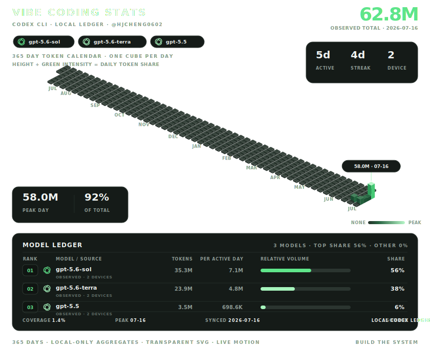

# Hi, I'm JinCheng Han 👋

Undergraduate at PKU focused on GPU kernels, CUDA architecture, and AI systems research.

  <picture>
    <source media="(prefers-color-scheme: dark)" srcset="./assets/year-grid-dark.svg">
    <source media="(prefers-color-scheme: light)" srcset="./assets/year-grid-light.svg">
    
  </picture>

## Focus

- **GPU kernels and CUDA architecture** — optimizing GEMM, FlashAttention, and TopK from CUDA C++ down to PTX/SASS, with particular attention to warp scheduling, shared memory, occupancy, TMA, Distributed Shared Memory, TMEM, UMMA, and cluster execution on Hopper and Blackwell.
- **AI systems and inference** — building and profiling efficient LLM systems with CUTLASS, CuTe, Nsight Compute, and Nsight Systems; the goal is architecture-aware performance analysis rather than API-level tuning alone.
- **MLSys research** — turning concrete systems questions into implementations, measurements, and publishable results. Previous work includes real-time dense reconstruction with the Visual Computing Lab's SLAM3R project, with current interests centered on GPU systems and ML infrastructure.

## Selected work

- [nanoPD](https://github.com/HJCheng0602/nanoPD) — a from-scratch Prefill/Decode disaggregation inference engine for LLMs.
- [SLAM3R OnlineCam](https://github.com/HJCheng0602/SLAM3R_onlinecam) — real-time dense reconstruction from an online camera stream.
- [paperwise](https://github.com/HJCheng0602/paperwise) — deep reading for research papers with LLM reports, a vector KB, and a knowledge graph.

## Dashboard sync

Collect and merge local Codex usage across macOS, Windows, and WSL. See the [multi-device setup guide](./docs/MULTI_DEVICE_SETUP.md) for first-time setup, SSH authentication, daily updates, and troubleshooting.

---

<i>Understand the system. Build the system.</i>

