  <picture>
    <source media="(prefers-color-scheme: dark)" srcset="./assets/profile-header-dark.svg">
    <source media="(prefers-color-scheme: light)" srcset="./assets/profile-header-light.svg">
    
  </picture>

  <picture>
    <source media="(prefers-color-scheme: dark)" srcset="./assets/year-grid-dark.svg">
    <source media="(prefers-color-scheme: light)" srcset="./assets/year-grid-light.svg">
    
  </picture>

  <picture>
    <source media="(prefers-color-scheme: dark)" srcset="./assets/focus-dark.svg">
    <source media="(prefers-color-scheme: light)" srcset="./assets/focus-light.svg">
    
  </picture>

  <picture>
    <source media="(prefers-color-scheme: dark)" srcset="./assets/selected-work-dark.svg">
    <source media="(prefers-color-scheme: light)" srcset="./assets/selected-work-light.svg">
    
  </picture>

## Dashboard sync

On macOS or Linux, run `./sync.sh` whenever you want to publish the latest local usage. It uses your system Node.js when available and otherwise uses the Node.js runtime bundled with Codex Desktop.

Collect and merge local Codex usage across macOS, Windows, and WSL. See the [multi-device setup guide](./docs/MULTI_DEVICE_SETUP.md) for first-time setup, SSH authentication, daily updates, and troubleshooting.

---

<i>Understand the system. Build the system.</i>

